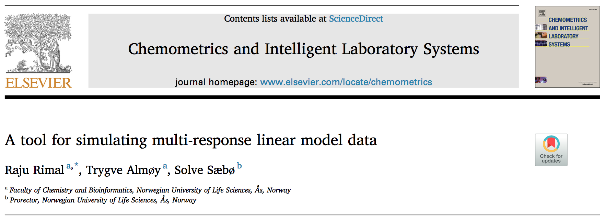
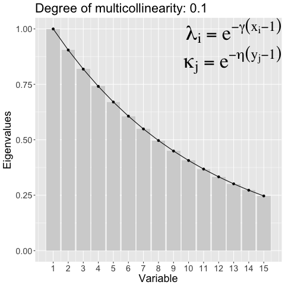
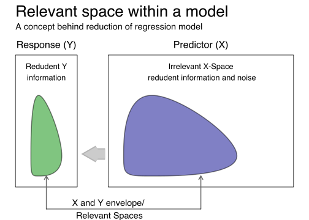
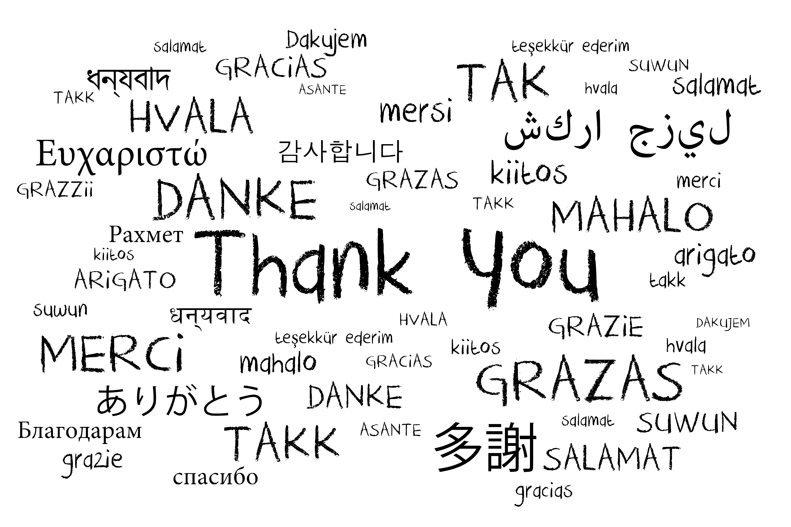

```{r, include = FALSE}
Sys.setenv(RGL_USE_NULL = TRUE)
library(knitr)
library(rgl)
knit_hooks$set(webgl = hook_webgl)
opts_chunk$set(
  comment = NA, fig.align = 'center', 
  echo = FALSE, out.width = '100%',
  retina = 2)
is_latex <- knitr::is_latex_output()
library(simrel)
library(ggplot2)
```

```{r, echo=FALSE}
sobj <- simrel(n = 20, p = 10, q = c(5, 4), m = 4, ypos = list(c(1, 4), c(2, 3)),
               relpos = list(c(1, 2), c(3, 5)), R2 = c(0.8, 0.8),
               gamma = 0.6, type = "multivariate", eta = 0.2)
```

## {.flexbox .vcenter .plain}

```{r}

```

<blockquote cite="http://www.imdb.com/character/ch0000672/quotes" id="main-quote">
<p class="quotation">Even the simplest tools can empower people to do great things</p>
<footer>— Biz Stone, <cite>Things a Little Bird Told Me: Confessions of the Creative Mind</cite></footer>
</blockquote>

## Why Simrel {.columns-2 .plain}

\begincols
\begincol{0.5\textwidth}

- Simulated data is __used everywhere__ in research to compare methods, models, algorithms, techniques etc. `Simrel` can be a common tool for such purpose

- Simulate _linear model_ data with _wide range of properties_ using __small set of tuning paramters__, Example:

    * Controlling _degree of multicollinearity_ in the simulated data
    
    * Specifying the _relevant principle components_ for prediction

<div style="break-before: column;"></div>

\endcol
\begincol{0.5\textwidth}

```{r}
if (is_latex) {
  knitr::include_graphics("_images/multicollinearity.pdf")
} else {
  
}
```

\endcol
\endcols

## Idea Behind {.columns-2 .plain}

\begincols
\begincol{0.5\textwidth}

_Reduction of regression Model_: A Predictor sub-space (<span class="blue">blue</span>) is relevant for informative response sub-space (<span class="green">green</span>)

```{r}
if (is_latex) {
  knitr::include_graphics("_images/relevant-space.pdf")
} else {
  
}
```

<div style="break-before: column;"></div>

\endcol
\begincol{0.5\textwidth}

<h3>The Model:</h3>
$$\begin{bmatrix}y \\ x \end{bmatrix} \sim \text{N}\left(
\begin{bmatrix}
\mu_y \\ \mu_x
\end{bmatrix}, 
\begin{bmatrix}
\Sigma_{yy} & \Sigma_{yx}\\
\Sigma_{xy} & \Sigma_{xx}
\end{bmatrix}
\right)$$

Define a linear tranformation as $z = Rx$ and $w = Qy$. For any orthogonormal matrix $R$ and $Q$, we can imagine them as a rotation (eigenvector) matrix, so,

$$\begin{bmatrix}y \\ x \end{bmatrix} \sim \text{N}\left(
\begin{bmatrix}
Q^t\mu_w \\ R^t\mu_z
\end{bmatrix}, 
\begin{bmatrix}
Q^t\Sigma_{ww}Q & Q^t\Sigma_{wz}R\\
R^t\Sigma_{zw}Q & R^t\Sigma_{zz}R
\end{bmatrix}
\right)$$

There are $\frac{1}{2}(p + m)(p + m + 1)$ unknowns to identify this model. But, ...

\endcol
\endcols

## Reduction of Regression Model {.columns-2 .plain}

## How it works {.columns-3 .plain}

```{r}
plt_types <- c("relpos", "rotation", "relpred")
plt_types <- `names<-`(plt_types, plt_types)
plts <- lapply(plt_types, function(t){
  lapply(c(FALSE, TRUE), function(ord){
    cov_plot(sobj, type = t, ordering = ord, facetting = FALSE)
  })
})
```


\begincols
\begincol{0.32\textwidth}

```{r, out.width='100%', message=FALSE, warning=FALSE, fig.width=3.5, fig.asp=1, dpi=300}
plts[["relpos"]][[1]]
```

<div style="break-before: column;"></div>
\endcol
\begincol{0.32\textwidth}

```{r, out.width='100%', message=FALSE, warning=FALSE, fig.width=3.5, fig.asp=1, dpi=300}
plts[["rotation"]][[1]]
```

<div style="break-before: column;"></div>
\endcol
\begincol{0.32\textwidth}

```{r, out.width='100%', message=FALSE, warning=FALSE, fig.width=3.5, fig.asp=1, dpi=300}
plts[["relpred"]][[1]]
```

\endcol
\endcols

## How it works {.columns-3 .plain}

\begincols
\begincol{0.32\textwidth}

```{r, out.width='100%', message=FALSE, warning=FALSE, fig.width=3.5, fig.asp=1, dpi=300}
plts[["relpos"]][[2]]
```

<div style="break-before: column;"></div>
\endcol
\begincol{0.32\textwidth}

```{r, out.width='100%', message=FALSE, warning=FALSE, fig.width=3.5, fig.asp=1, dpi=300}
plts[["rotation"]][[2]]
```

<div style="break-before: column;"></div>
\endcol
\begincol{0.32\textwidth}

```{r, out.width='100%', message=FALSE, warning=FALSE, fig.width=3.5, fig.asp=1, dpi=300}
plts[["relpred"]][[2]]
```

\endcol
\endcols

## Where Simrel {.plain}


## Example Simrel {.plain}

## Acknoledgement {.plain}
- Trygve
- Solve
- Franchisco
- Lars


```{r, include = !is_latex, results='asis', echo=FALSE}
cat("## {data-background='_images/ThankYou.png' data-background-position='center' data-background-size='100% 100%' .plain}")
```


```{r, out.width='100%', eval = is_latex, results='asis', echo = FALSE}
cat("## {.plain}")

```
